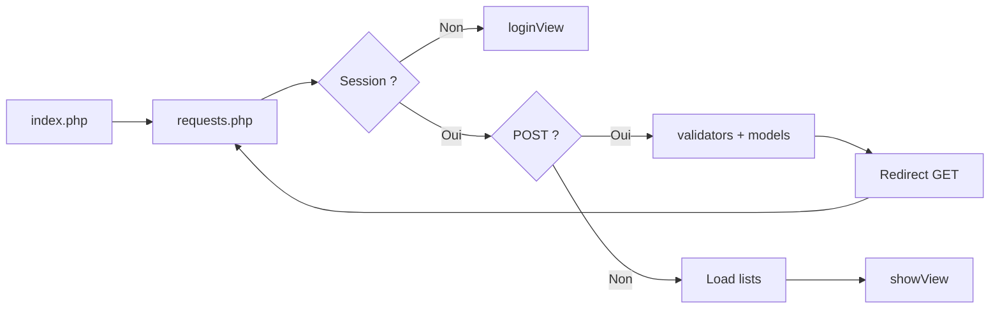

# Architecture — Domaine de Gach

Document de référence pour la structure du dépôt, le **back-office PHP** (MVC léger) et les flux de données. Pour l’installation et l’usage, voir [`README.md`](README.md).

---

## Vue d’ensemble

| Couche | Rôle |
|--------|------|
| **Site vitrine** | Pages HTML statiques, `css/`, `js/`, `img/` — présentation du gîte. |
| **Back-office** | PHP : authentification, gestion **clients** et **réservations** ; lecture des **chambres**. |
| **Persistance** | MySQL, accès via **PDO** et scripts SQL (`php/gachDb.sql`). |
| **Tests** | PHPUnit + SQLite en mémoire (`tests/`), optionnel. |

---

## Arborescence utile

```text
domaineDeGach/
├── README.md
├── ARCHITECTURE.md
├── phpunit.xml
├── index.html
├── chambres.html
├── chambre-*.html
├── autour.html
├── localiser.html
├── contact.html
├── mentions-legales.html
├── css/
│   └── style.css
├── js/
│   ├── main.js
│   ├── carousel.js
│   └── contact.js
├── img/                          # Médias du site public (sous-dossiers par thème)
├── tests/
│   ├── bootstrap.php             # SQLite + schéma minimal pour PHPUnit
│   └── ReservationModelTest.php
├── php/
│   ├── index.php                 # Point d’entrée back-office
│   ├── content.php               # (héritage / utilitaires selon déploiement)
│   ├── gachDb.sql                # Création BDD + jeux d’essais
│   ├── sql/
│   │   ├── gachDb.sql            # Copie / variante documentaire
│   │   ├── modeleRelationnel.txt
│   │   └── lien.txt
│   ├── Config/
│   │   ├── database.php          # PDO MySQL, constantes + getPdo()
│   │   └── env.local.php         # Mot de passe BDD (local, non versionné)
│   ├── Controller/
│   │   ├── requests.php          # Contrôleur principal (utilisé en production)
│   │   ├── clientRequests.php    # Non branché sur index (refactor possible)
│   │   ├── reservationRequests.php
│   │   ├── chambreRequests.php
│   │   └── controllerHelpers.php
│   ├── Model/
│   │   ├── chambreModel.php      # Lecture des chambres
│   │   ├── clientModel.php       # CRUD clients + unicité email
│   │   ├── reservationModel.php  # CRUD réservations + chevauchement
│   │   └── userModel.php         # USERS, password_verify
│   ├── Validation/
│   │   └── validators.php        # Règles serveur (email, tel, dates, ids)
│   └── Views/
│       ├── loginView.php
│       └── showView.php          # Admin : tableaux + formulaires
└── .github/
    └── workflows/
        └── static.yml             # Déploiement GitHub Pages (vitrine statique)
```

Les fichiers `*Requests.php` (hors `requests.php`) sont des **brouillons de découpage** : seul **`requests.php`** est chargé par `index.php`. Tu peux soit les supprimer, soit y déléguer progressivement la logique POST.

---

## MVC back-office

### 1. Point d’entrée — `php/index.php`

- Configure les paramètres du cookie de session (`httponly`, `secure` si HTTPS, `samesite`).
- Démarre `session_start()` si nécessaire.
- Inclut **`Controller/requests.php`**.

### 2. Contrôleur — `php/Controller/requests.php`

- **Sans session valide** (hors action login) : affiche `loginView.php`.
- **POST `action=login`** : validation légère des champs → `userModel_verifyLogin` → redirection ou erreur.
- **GET `action=logout`** : destruction de session → redirection.
- **Utilisateur connecté + POST** : routage selon `action` :
  - `add_client`, `update_client`, `delete_client`
  - `add_reservation`, `update_reservation`, `delete_reservation`
- Après traitement : **`header('Location: …?success=…')`** ou **`?error=…`** (PRG : Post/Redirect/Get).
- **GET `edit_client` / `edit_reservation`** : charge l’entité pour préremplir les formulaires dans la vue.
- En fin de script : charge les listes via les modèles puis **`Views/showView.php`**.

### 3. Modèles — `php/Model/*.php`

Fonctions procédurales ; chaque fichier regroupe l’accès à une table (ou un domaine).

| Fichier | Responsabilité |
|---------|------------------|
| `chambreModel.php` | `chambreModel_getAll()` |
| `clientModel.php` | CRUD + `emailTakenByOther`, `getById` |
| `reservationModel.php` | CRUD + `hasOverlap`, `foreignKeysExist`, `getById` |
| `userModel.php` | Connexion, création utilisateur (hash) |

Toutes les requêtes passent par **`getPdo()`** (`database.php`) avec **requêtes préparées** lorsque des paramètres sont injectés.

### 4. Validation — `php/Validation/validators.php`

Appelée **avant** les modèles dans le contrôleur : email (`filter_var`), téléphone, dates `Y-m-d`, plage réservation (sortie > entrée), entiers strictement positifs pour les `id`.

### 5. Vues — `php/Views/*.php`

- **`loginView.php`** : formulaire identifiant / mot de passe ; styles intégrés.
- **`showView.php`** : en-tête, cartes par section (chambres, clients, réservations), tableaux, formulaires, messages flash selon `$_GET['success']` / `$_GET['error']` ; styles intégrés.

Aucun moteur de templates : PHP “nu” avec échappement **`htmlspecialchars`** sur les données utilisateur.

### 6. Configuration — `php/Config/database.php`

- Constantes `DB_HOST`, `DB_PORT`, `DB_NAME`, `DB_USER`, `DB_CHARSET`.
- Mot de passe : `env.local.php` ou variable d’environnement `GACH_DB_PASS`.
- **`getPdo()`** : singleton statique, `ERRMODE_EXCEPTION`, retourne `null` en cas d’échec (la vue affiche un message générique).

---

## Schéma de données (logique)

- **Script principal** : `php/gachDb.sql`
- **Tables** : `CLIENTS`, `CHAMBRES`, `RESERVATIONS`, `USERS`
- **Relations** :
  - `RESERVATIONS.idClient` → `CLIENTS.id` (ON DELETE CASCADE selon script)
  - `RESERVATIONS.idChambre` → `CHAMBRES.id`

**Règle métier** : deux réservations sur la **même chambre** ne peuvent pas avoir des périodes qui se chevauchent (voir `reservationModel_hasOverlap`).

Documentation textuelle complémentaire : `php/sql/modeleRelationnel.txt`.

---

## Flux de requête (résumé)



1. Le navigateur appelle `index.php`.
2. Le contrôleur vérifie la session et traite login / logout.
3. Si **POST** métier : validation → modèle → **redirection** avec paramètre de flash.
4. Si **GET** (ou après redirect) : rechargement des données → **showView**.

---

## Tests automatisés

- **`phpunit.xml`** : bootstrap `tests/bootstrap.php`.
- **`tests/bootstrap.php`** : crée une base **SQLite** en mémoire, tables alignées sur le schéma métier minimal, charge les modèles.
- **`tests/ReservationModelTest.php`** : exemple sur `reservationModel_hasOverlap` et clés étrangères.

Lancer : `vendor/bin/phpunit` (après `composer require --dev phpunit/phpunit`). Voir `README.md`.

---

## Sécurité (rappel)

| Mesure | Où |
|--------|-----|
| PDO préparé | Modèles |
| `password_hash` / `password_verify` | `userModel.php` |
| Cookie session `httponly`, `samesite`, `secure` adaptatif | `index.php` |
| `session_regenerate_id` après login | `requests.php` |
| `htmlspecialchars` | Vues |
| Validation serveur | `validators.php` + contrôleur |

**Pistes d’amélioration** : jetons **CSRF** sur les formulaires POST, ne pas exposer d’identifiants BDD inutiles dans le dépôt, limitation des tentatives de connexion.

---

## Déploiement

- **GitHub Pages** (workflow `static.yml`) : adapté au site **HTML/CSS/JS** ; **pas d’exécution PHP**.
- **Hébergement PHP + MySQL** : nécessaire pour `index.php`, `Config`, et la base distante.

---

*Dernière mise à jour : alignée sur la structure du dépôt et le contrôleur `requests.php`.*
